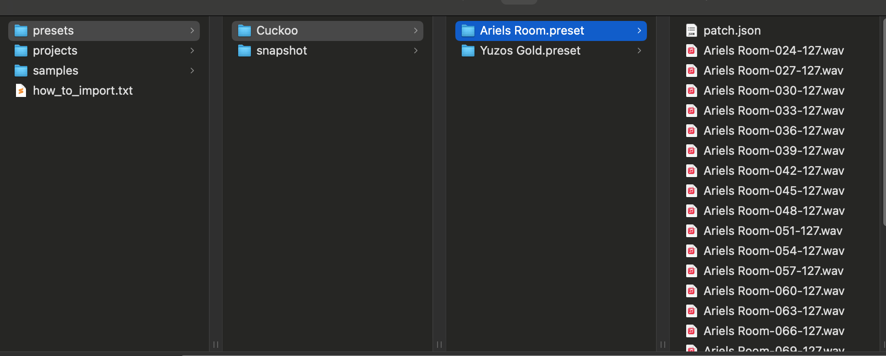

# OPXY Multisample Tool

A collection of tools for generating, recording, and packing mulitsamples for the OPXY.

## Features

- Automatically record multisamples from any midi device (or DAW on Mac) using RecordSamples.py
- Generates preset JSON for OPXY multisample instrument.
- Properly names files according to OPXY naming standards.
- Packs JSON and Audio Files into the appropriate file structure for OPXY.
- Use the --help flag to display usage information.

## Table of Contents

- [Installation](#installation)
- [Recording Samples](#recording-samples)
- [Packing Samples](#packing-samples)
- [Copying Presets onto the XY](#copying-presets-onto-the-opxy)
- [License](#license)

## Installation

There are a few tools required to use the Multisample Tools.

### Python 3 

1. Visit the official Python website: [https://www.python.org/downloads/](https://www.python.org/downloads/).
2. Click on the "Download Python 3.x.x" button (the latest version).
3. Run the installer. **Important**: During installation, check the box that says **"Add Python to PATH"** before proceeding.

### Pip Requirements
1. In terminal browse the directory where you downloaded this repo
2. Install pip requirements with: `pip install -r requirements.txt` or `pip3 install -r requirements.txt` if you have both python 2 and 3 installed on your system.

### ffmpeg (Windows)

1. Download the latest FFmpeg build from the official website: [https://ffmpeg.org/download.html](https://ffmpeg.org/download.html).
2. Extract the ZIP file to a location on your system (e.g., `C:\ffmpeg`).
3. Add both `ffmpeg` and `ffprobe` to your system's PATH:
   - Right-click **This PC** and select **Properties**.
   - Click on **Advanced system settings** > **Environment Variables**.
   - Under **System Variables**, find and select **Path**, then click **Edit**.
   - Add the path to the `bin` folder inside the extracted FFmpeg folder (e.g., `C:\ffmpeg\bin`).
4. Restart any terminals for the PATH changes to take.

### ffmpeg (Mac)

1. Install Homebrew (if not already installed) by running the following command in Terminal:
   `bash /bin/bash -c "$(curl -fsSL https://raw.githubusercontent.com/Homebrew/install/HEAD/install.sh)"`
2. Install FFmpeg (which includes ffmpeg and ffprobe) via Homebrew:
    `brew install ffmpeg`


## Recording Samples

The `RecordSamples.py` is useful for automatically recording multisamples from an external instrument or DAW and packing them into a preset for the OP-XY

### Usage

To run the script open terminal and navigate to the folder containing this repo. Executed the script with `python RecordSamples.py`

You will then be guided through the recording process with onscreen instructions.

The tool will record a sample for each note and automatically generate a multisampler preset for the OP-XY.

The next step is to [copy the presets onto the OP-XY](#copying-presets-onto-the-opxy)

## Packing Samples

The `PackSamples.py` script is useful for packing an existing folder of wav files into a multisample instrument for the OP-XY

### Prep

The sample packer expects a list of wav files, one for each note key you want sampled. The OP-XY will automatically fill in the missing notes by pitch bending the nearest wav file.

Samples can be named in a couple of ways:

1. By midi note number. Where the note number is a number from 0-127. With 0 being C-1, 127 being G9 and 60 is C4.

`Sample Name-[Note Number].wav`
```
"InputFolder\My Awesome Sample-48.wav"  < C3
"InputFolder\My Awesome Sample-60.wav"  < Middle C
"InputFolder\My Awesome Sample-65.wav"  < E#4
```

2. By note name and octave.

`Sample Name-[Note Name].wav`
```
"InputFolder\My Awesome Sample-C3.wav"
"InputFolder\My Awesome Sample-Eb7.wav"
"InputFolder\My Awesome Sample-G#-1.wav"
```

Sometimes samples are named with a note and a velocity (`My Awesome Sample-48-127.wav`).
The OP-XY does not currently support velocity mappings.
There is no need to rename these. The script will automatically choose the highest velocity for each note.

### Usage

Once your samples are grouped into a folder, open terminal and navigate to the folder containing this repo. 

Execute the script like so:

`python PackSamples.py --input /Path/To/Sample/Directory --output /Path/To/Output/Directory --name "Preset Name"`

_NOTE: Be sure to set your output directory to a different directory from the input!_

_NOTE: The name argument is optional- if a name is not provided then the preset will be inferred from the sample name._

The resulting instrument pack will be placed in the output directory and the audio files will be copied into it.

The next step is to [copy the presets onto the OP-XY](#copying-presets-onto-the-opxy)

### Script Arguments

- `--input` The input directory that contains your samples. Required.
- `--output` The output directory where the preset instruments are copied. Required.
- `--name` The name of the preset. Optional. If no name is passed the name is inferred from the sample file names.
- `--bulk` Pass a folder containing multiple subfolders of samples into the bulk command along with an output directory.
- `--sample_rate` Forces re-encoding of samples to a specific sample rate. TIP The OP-XY seems to prefer samples around 22050. 
- `--sample_start` Time in seconds for the sample start point. Useful for samples that have a bit of silence at the beginning.
The tool will then run the pack command for each subfolder automatically.

## Copying Presets onto the OPXY

_NOTE If you are on a Mac ensure that you download the [FieldKit App](https://teenage.engineering/guides/fieldkit) and run it. This enables the Mac to mount the XY._

It's a good idea to create a new empty project on the OP-XY before copying and to power cycle before and after copying.

Plug in your OP-XY and turn it on. Press `com` and then `4: mtp`
The OP-XY should then show up as a drive on your computer.

Copy the output into the OPXY 'presets' directory.
Instrument presets can be grouped into a subdirectory one level deep.

```
OPXY\preset\Group Folder\My Awesome Preset.preset
OPXY\preset\Group Folder\My Second Awesome Preset.preset
```

**NOTE After copying samples eject the OP-XY and power cycle the device. For some reason samples don't always load until the device is power cycled.**

Example OPXY


## Advanced Usage


## License

MIT License